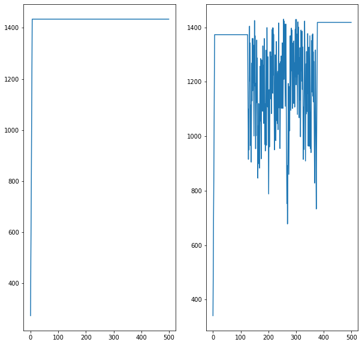

# 超啟發式演算法（Meta-heuristic Algorithm）
## 作業要求說明
分別使用以下方法解 Knapsack 01
1. 使用 Dynamic Programming
2. 使用 Hill Climbing
3. 使用 Simulated Annealing

第一項實作於 ```dynamic_programming.py``` 中
第二及第三項實作於 ```machine_learning.ipynb```

## Dynamic Programming
程式碼參考自: https://leetcode.com/problems/target-sum/discuss/1157060/01-knapsack

Knapsack 01 屬於 NPC 問題，使用 Time Complexity 是 $\mathcal{O(nW)}$，其中 $n$ 為物件個數、$W$ 為背包承重，詳情見以前的演算法概論教課內容。

## Hill Climbing
參考自:
- https://en.wikipedia.org/wiki/Hill_climbing
- http://debussy.im.nuu.edu.tw/sjchen/ML_final.html
- http://debussy.im.nuu.edu.tw/sjchen/MachineLearning/final/Opt_SA.pdf

Hill Climbing 操作步驟有：
1. 設定起始狀態
2. 執行鄰域搜尋
3. 測試停止條件

物件分為取與不取，因此在程式碼中
```python
s1 = np.zeros((NUMBER_OF_OBJECTS), dtype=int)
historySelection1 = np.zeros(ITER_RANGE, dtype=int)
```
```sl``` 表示 hill climbing 當下的選定的物品、
```historySelection1``` 表示每次迭代的 profit 數值
### 設定起始狀態
我設定為隨機先取其中一個物件作為起始狀態
```python
import random
# selection one
s1 = np.zeros((NUMBER_OF_OBJECTS), dtype=int)
historySelection1 = np.zeros(ITER_RANGE, dtype=int)

while(1):
    seed = random.randint(0, NUMBER_OF_OBJECTS - 1)
    s1[seed] = 1
    np.random.shuffle(s1)
    if  KNAPSACK_CAP > getSumOfWeight(s1):
        break
    ()
```

### 執行鄰域搜尋
取得該狀態下的鄰域(Neighborhood)，分為：選取尚未選取的物品、移除已選取的物品

```python
def getNeighborhood(arr: np.ndarray):
    nn = np.repeat(arr, repeats=NUMBER_OF_OBJECTS, axis=0).reshape((NUMBER_OF_OBJECTS,NUMBER_OF_OBJECTS)).transpose()
    for i in range(NUMBER_OF_OBJECTS):
        nn[i][i] = not nn[i][i]
        ()
    return nn
```


只要新的 Neighborhood 的 profit 大於當前迭代的 profit，就以 Neighborhood 作為新的 ```s1```

```python
for x in range(ITER_RANGE):
    iterMaxProfit = getSumOfProfit(s1)
    nn = getNeighborhood(s1)
    np.random.shuffle(nn)
    for i in range(NUMBER_OF_OBJECTS):
        if  KNAPSACK_CAP > getSumOfWeight(nn[i]):
            nProfit = getSumOfProfit(nn[i])
            if  iterMaxProfit < nProfit:
                s1 = nn[i]
                iterMaxProfit = nProfit
                break
                ()
            ()
        ()
    historySelection1[x] = iterMaxProfit
    ()
```
### 測試停止條件
原本的停止條件為：當迭代的 profit 數值沒有變化時停止，但這裡只做 500 次迭代，因此中止條件只用 500 次迭代。

## Simulated Annealing
參考自:
- http://debussy.im.nuu.edu.tw/sjchen/ML_final.html
- http://debussy.im.nuu.edu.tw/sjchen/MachineLearning/final/Opt_SA.pdf

1. 設定起始狀態
2. 執行鄰域搜尋
3. 執行冷卻時程
4. 測試停止條件

這裡我理解為 Hill Climbing 再加上某種隨機函數使當前迭代可接受較小 profit

```diff
+ def shouldAccept(num: int):
+    return 125 < num and num < 375
+    ()

for x in range(ITER_RANGE):
    iterMaxProfit = getSumOfProfit(s2)
    nn = getNeighborhood(s2)
    np.random.shuffle(nn)
    for i in range(NUMBER_OF_OBJECTS):
        if  KNAPSACK_CAP > getSumOfWeight(nn[i]):
            nProfit = getSumOfProfit(nn[i])
+            if  iterMaxProfit < nProfit or shouldAccept(x):
                s2 = nn[i]
                iterMaxProfit = nProfit
                break
                ()
            ()
    historySelection2[x] = iterMaxProfit
    ()
```

擷取其中一個結果

Hill Climbing: 1434
Simulated Annealing: 1418




## 過程與心得
這是我第一次聽到爬山演算法跟模擬退火演算法，我想說名字這麼潮又是解 knapsacl 01 問題鐵定很難。
### Hill Climbing
在理解 Hill Climbing algo 前一直有疑問，不使用 dynamic programming 如何取的全域最佳解，但是去了解之後發現只要局部最佳解即可。

### Simulated Annealing
之前的內容提到是將 Simulated Annealing 當作一種 Hill Climbing，實際上在選定隨機函數的部份是其關鍵的地方，我在這個作業就是簡單寫個 ```shouldAccept``` 直接解決