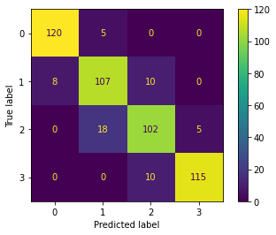
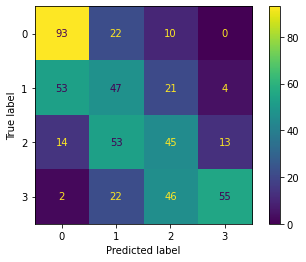
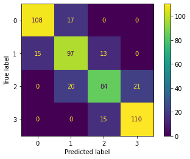
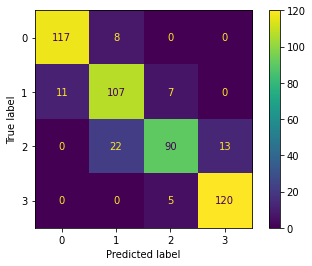

# Mobile Price Classification
## 程式碼內容
程式碼內容參考 [Mobile Price Classification using SVM by Mateus Jorge](https://www.kaggle.com/code/mateusjorge/mobile-price-classification-using-svm) 

其它 KNN, Decision Tree, Random Forest 的程式碼皆仿照 Mateus Jorge 寫成
因 SKLearn 已經提供以上 classification 的實作，只要大略知道其概念即可。

在檔案 ```mobile-price-classification.ipynb``` 中，基本的流程就是：
1. 讀取 ```train.csv``` 資料
    - 將資料分成 ```train data``` 跟 ```test data```
    - 使用 ```StandardScalar()``` 標準化 ```train.csv``` 資料內容
2. 使用各個 classification method 跑結果

因為只差在使用的 classification method 不同，程式碼簡化成以下
```python
def foobar(method):
    method.fit(X_train_sc, y_train)
    preds = method.predict(X_test_sc)
    acc = accuracy_score(y_test, preds)
    print("Accuracy: %.2f%%" % (acc * 100))
    plot_confusion_matrix(method, X_test_sc, y_test)
    class_rep = classification_report(y_test, preds)
    print(class_rep)
    ()
```

## Confusion Matrix

The confusion matrix consists of four basic characteristics (numbers) that are used to define the measurement metrics of the classifier. These four numbers are:
1. TP (True Positive)
2. TN (True Negative)
3. FP (False Positive)
4. FN (False Negative)

- Accuracy: $(TP + TN) / (TP + TN + FP + FN)$
- Precision: $TP / (TP + FP)$
- Recall: $TP / (TP + FN)$
- F1 score(F Measure): The F1 score states the equilibrium between the precision and the recall
    - F1 score: $2*precision*recall / (precision + recall)$
> 參考 [ScienceDirect Confusion Matrix](https://www.sciencedirect.com/topics/engineering/confusion-matrix#:~:text=A%20confusion%20matrix%20is%20a,performance%20of%20a%20classification%20algorithm.)

## 結果
### ```SVC``` 顯示的內容
```python
from sklearn.svm import SVC
svc = SVC()
foobar(svc)
```

```
Accuracy: 88.80%
              precision    recall  f1-score   support

           0       0.94      0.96      0.95       125
           1       0.82      0.86      0.84       125
           2       0.84      0.82      0.83       125
           3       0.96      0.92      0.94       125

    accuracy                           0.89       500
   macro avg       0.89      0.89      0.89       500
weighted avg       0.89      0.89      0.89       500
```



X 軸為 Predicted label， Y 軸為 True Label

從以上圖片中可以快速得知，在此預測模型中，以數字 ```0``` 來說，有 120 個 ```0``` 預測正確，```5``` 個 ```0``` 被預測成 1 

### ```KNN``` 顯示的內容
```python
from sklearn.neighbors import KNeighborsClassifier
knn = KNeighborsClassifier()
foobar(knn)
```

```
Accuracy: 48.00%
              precision    recall  f1-score   support

           0       0.57      0.74      0.65       125
           1       0.33      0.38      0.35       125
           2       0.37      0.36      0.36       125
           3       0.76      0.44      0.56       125

    accuracy                           0.48       500
   macro avg       0.51      0.48      0.48       500
weighted avg       0.51      0.48      0.48       500
```



X 軸為 Predicted label， Y 軸為 True Label

### Decision Tree 顯示的內容
```python
from sklearn import tree
dt = tree.DecisionTreeClassifier()
foobar(dt)
```

```
Accuracy: 79.80%
              precision    recall  f1-score   support

           0       0.88      0.86      0.87       125
           1       0.72      0.78      0.75       125
           2       0.75      0.67      0.71       125
           3       0.84      0.88      0.86       125

    accuracy                           0.80       500
   macro avg       0.80      0.80      0.80       500
weighted avg       0.80      0.80      0.80       500
```


### Random Forest 顯示的內容
```python
from sklearn.ensemble import RandomForestClassifier
rt = RandomForestClassifier(n_estimators=100, random_state=0)
foobar(rt)
```

```
Accuracy: 86.80%
              precision    recall  f1-score   support

           0       0.91      0.94      0.92       125
           1       0.78      0.86      0.82       125
           2       0.88      0.72      0.79       125
           3       0.90      0.96      0.93       125

    accuracy                           0.87       500
   macro avg       0.87      0.87      0.87       500
weighted avg       0.87      0.87      0.87       500
```



## 想法
每個 classification method 產生的 ```precision``` 跟 ```recall``` 數值不一樣，可能前者比後者高或是想反的情形都有。

從網路上擷取的說明：
> 參考 [如何辨識模型的優劣](https://www.ycc.idv.tw/confusion-matrix.html)
> 
> 如果是門禁系統，我們希望Precision可以很高，Recall就相較比較不重要，我們比較在意的是預測正向（開門）的答對多少，比較不在意實際正向（是主人）的答對多少。如果是廣告投放，則Recall很重要，Precision就顯得沒這麼重要了，因為此時我們比較在意的是實際正向（是潛在客戶）的答對多少，而相對比較不在意預測正向（廣告投出）答對多少。

這次的題目是 Bob 想要賣手機給蘋果三星好看，那我想就模型選定會以 ```Recall``` 數值高的模型為主。